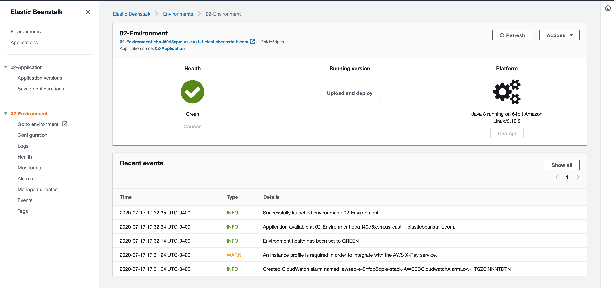

# cdk-elastic-beanstalk-examples

## Overview

AWS CDK enables you to codify infrastructure within your a variety of programming languages to build resuable constructs that generate large amounts of AWS CloudFormation. The ratio of effort input vs value output is astounding.

In this repository is a public learning effort gradually ramping up toward full SDLC of an application backed by AWS ElasticBeanstalk.

Notably, AWS CDK has L1 constructs for AWS ElasticBeanstalk. My hope is to take what exists today in AWS CDK as far as it can go, and organically find what L2/L3 constructs for AWS ElasticBeanstalk that could benefit the community.

## [`01-creating-an-application`](./01-creating-an-application/lib/01-creating-an-application-stack.ts)

AWS Elastic Beanstalk has a concept of an Application that houses multiple environments. Here, we create that Application, that really doesn't do much for us, but is a great start!

- [`AWS CDK App`](./01-creating-an-application/bin/01-creating-an-application..ts)
- [`Underlying stack`](./01-creating-an-application/lib/01-creating-an-application-stack..ts)

<details><summary>Steps + Shell Output</summary>
<p>

```bash
▶ cd 01-creating-an-application
▶ npm i

# Let's validate our synthesized CloudFormation
▶ npm run test

> 01-creating-an-application@0.1.0 test /Users/Bluegrass-Dev/github.com/bluegrass-dev/cdk-elastic-beanstalk-examples/01-creating-an-application
> jest

 PASS  test/01-creating-an-application.test.ts
  ✓ ElasticBeanstalk Application Created (187ms)

Test Suites: 1 passed, 1 total
Tests:       1 passed, 1 total
Snapshots:   0 total
Time:        1.664s, estimated 3s
Ran all test suites.


# 🚢 it!
▶ npm run cdk deploy

> 01-creating-an-application@0.1.0 cdk /Users/Bluegrass-Dev/github.com/bluegrass-dev/cdk-elastic-beanstalk-examples/01-creating-an-application
> cdk "deploy"

CreatingAnApplicationStack: deploying...
CreatingAnApplicationStack: creating CloudFormation changeset...
[██████████████████████████████████████████████████████████] (3/3)


 ✅  CreatingAnApplicationStack

Stack ARN:
arn:aws:cloudformation:us-west-2:140483673113:stack/CreatingAnApplicationStack/d0ed1ea0-c86e-11ea-b97b-06724f918394

# throw it in the 🗑️ when you're done!
▶ npm run cdk destroy

> 01-creating-an-application@0.1.0 cdk /Users/Bluegrass-Dev/github.com/bluegrass-dev/cdk-elastic-beanstalk-examples/01-creating-an-application
> cdk "destroy"

Are you sure you want to delete: CreatingAnApplicationStack (y/n)? y
CreatingAnApplicationStack: destroying...


 ✅  CreatingAnApplicationStack: destroyed
```

</p>
</details>

<details><summary>AWS Console Images</summary>
<p>

### AWS ElasticBeanstalk Application


### AWS CloudFormation Console


</p>
</details>

## [`02-creating-an-environment`](./02-creating-an-environment/lib/02-creating-an-environment-stack.ts)

Next, let's create an AWS ElasticBeanstalk Application again, then create a single Environment running Java 8.

- [`AWS CDK App`](./02-creating-an-environment/bin/02-creating-an-environment.ts)
- [`Underlying stacks`](./02-creating-an-environment/lib/02-creating-an-environment-stack.ts)

<details><summary>Steps + Shell Output</summary>
<p>

```bash
▶ cd 02-creating-an-environment
▶ npm i

# Let's validate our synthesized CloudFormation
▶ npm run test

> 02-creating-an-environment@0.1.0 test /Users/Bluegrass-Dev/github.com/bluegrass-dev/cdk-elastic-beanstalk-examples/02-creating-an-environment
> jest

 PASS  test/02-creating-an-environment.test.ts
  ✓ ElasticBeanstalk Application Created (203ms)
  ✓ ElasticBeanstalk Environment Created (119ms)

Test Suites: 1 passed, 1 total
Tests:       2 passed, 2 total
Snapshots:   0 total
Time:        2.58s, estimated 3s
Ran all test suites.

# 🚢 it!
▶ npm run cdk deploy '*'

> 02-creating-an-environment@0.1.0 cdk /Users/Bluegrass-Dev/github.com/bluegrass-dev/cdk-elastic-beanstalk-examples/02-creating-an-environment
> cdk "deploy" "*"

CreatingAnEnvironmentStack: deploying...
CreatingAnEnvironmentStack: creating CloudFormation changeset...


 ✅  CreatingAnEnvironmentStack

Outputs:
CreatingAnEnvironmentStack.EnvironmentUrl = http://awseb-e-9-AWSEBLoa-PMCKHN9GSWUA-1954471332.us-east-1.elb.amazonaws.com

Stack ARN:
arn:aws:cloudformation:us-east-1:858981056259:stack/CreatingAnEnvironmentStack/79f67d20-c874-11ea-ac16-0e58854680da

# throw it in the 🗑️ when you're done!
▶ npm run cdk destroy

> 02-creating-an-environment@0.1.0 cdk /Users/Bluegrass-Dev/github.com/bluegrass-dev/cdk-elastic-beanstalk-examples/02-creating-an-environment
> cdk "destroy"

Are you sure you want to delete: CreatingAnEnvironmentStack (y/n)? y
CreatingAnEnvironmentStack: destroying...
5:47:08 PM | DELETE_IN_PROGRESS   | AWS::CloudFormation::Stack         | CreatingAnEnvironmentStack
5:50:14 PM | DELETE_IN_PROGRESS   | AWS::ElasticBeanstalk::Application | Application

 ✅  CreatingAnEnvironmentStack: destroyed
```

</p>
</details>

<details><summary>AWS Console Images</summary>
<p>

### AWS ElasticBeanstalk Application



### AWS CloudFormation Console


### The running application


</p>
</details>

## [`03-environment-using-spot-instances`](./03-environment-using-spot-instances/)

Let's be cost conscious and create our Environments utilizing AWS EC2 Spot Instances through the native support via AWS ElasticBeanstalk!

- [`AWS CDK App`](./03-environment-using-spot-instances/bin/03-environment-using-spot-instances.ts)
- [`Underlying stacks`](./03-environment-using-spot-instances/lib/03-environment-using-spot-instances-stack.ts)

<details><summary>Steps + Shell Output</summary>
<p>

```bash
▶ cd 03-environment-using-spot-instances
▶ npm i

# Let's validate our synthesized CloudFormation
▶ npm run test

> 03-environment-using-spot-instances@0.1.0 test /Users/Bluegrass-Dev/github.com/bluegrass-dev/cdk-elastic-beanstalk-examples/03-environment-using-spot-instances
> jest

 PASS  test/03-environment-using-spot-instances.test.ts
  ✓ ElasticBeanstalk Application Created (210ms)
  ✓ ElasticBeanstalk Environment Created (116ms)
  ✓ ElasticBeanstalk Environment is using 100% Spot Instances (118ms)

Test Suites: 1 passed, 1 total
Tests:       3 passed, 3 total
Snapshots:   0 total
Time:        3.806s
Ran all test suites.

# 🚢 it!
▶ npm run cdk deploy '*'

> 03-environment-using-spot-instances@0.1.0 cdk /Users/Bluegrass-Dev/github.com/bluegrass-dev/cdk-elastic-beanstalk-examples/03-environment-using-spot-instances
> cdk "deploy" "*"

EnvironmentUsingSpotInstancesStack: deploying...
EnvironmentUsingSpotInstancesStack: creating CloudFormation changeset...
[██████████████████████████████████████████████████████████] (4/4)


 ✅  EnvironmentUsingSpotInstancesStack

Stack ARN:
arn:aws:cloudformation:us-east-1:858981056259:stack/EnvironmentUsingSpotInstancesStack/29b3ee70-c878-11ea-89cf-0e05d1a3c102


# throw it in the 🗑️ when you're done!
▶ npm run cdk destroy

> 03-environment-using-spot-instances@0.1.0 cdk /Users/Bluegrass-Dev/github.com/bluegrass-dev/cdk-elastic-beanstalk-examples/03-environment-using-spot-instances
> cdk "destroy"

Are you sure you want to delete: EnvironmentUsingSpotInstancesStack (y/n)? y
EnvironmentUsingSpotInstancesStack: destroying...

 ✅  EnvironmentUsingSpotInstancesStack: destroyed

```

</p>
</details>

<details><summary>AWS Console Images</summary>
<p>

### AWS ElasticBeanstalk Environment Capacity Options


</p>
</details>

## [`04-multiple-environments`](./04-multiple-environments/)

Alright, we have our Application and Environment in place, but what's it look like to create multiple Environments? Do we have to copy/paste code, or can we make it reusable?

🚨🚨 Spoiler alert: we can make a parameterized stack and instantiate multiple! 🚨🚨

- [`AWS CDK App`](./04-multiple-environments/bin/04-multiple-environments..ts)
- [`Underlying stacks`](./04-multiple-environments/lib/04-multiple-environments-stack..ts)

<details><summary>Steps + Shell Output</summary>
<p>

```bash
▶ cd 04-multiple-environments
▶ npm i

# Let's validate our synthesized CloudFormation
▶ npm run test

> 04-multiple-environments@0.1.0 test /Users/Bluegrass-Dev/github.com/bluegrass-dev/cdk-elastic-beanstalk-examples/04-multiple-environments
> jest

 PASS  test/04-multiple-environments.test.ts
  ✓ ElasticBeanstalk Application Created (208ms)
  ✓ ElasticBeanstalk Environments Created (129ms)

Test Suites: 1 passed, 1 total
Tests:       2 passed, 2 total
Snapshots:   0 total
Time:        3.569s
Ran all test suites.

# 🚢 it!
▶ npm run cdk deploy '*'

> 04-multiple-environments@0.1.0 cdk /Users/Bluegrass-Dev/github.com/bluegrass-dev/cdk-elastic-beanstalk-examples/04-multiple-environments
> cdk "deploy" "*"

ApplicationStack
ApplicationStack: deploying...
ApplicationStack: creating CloudFormation changeset...

 ✅  ApplicationStack

Stack ARN:
arn:aws:cloudformation:us-east-1:858981056259:stack/ApplicationStack/cfe8c270-c878-11ea-98ca-0ab389d40b93
Environment1Stack
Environment1Stack: deploying...
Environment1Stack: creating CloudFormation changeset...

 ✅  Environment1Stack

Stack ARN:
arn:aws:cloudformation:us-east-1:858981056259:stack/Environment1Stack/da126210-c878-11ea-b389-1272d872aba7
Environment2Stack
Environment2Stack: deploying...
Environment2Stack: creating CloudFormation changeset...

 ✅  Environment2Stack

Stack ARN:
arn:aws:cloudformation:us-east-1:858981056259:stack/Environment2Stack/53b4b050-c879-11ea-9f91-122ae4ce5d77

# throw it in the 🗑️ when you're done!

▶ npm run cdk destroy '*'

> 04-multiple-environments@0.1.0 cdk /Users/Bluegrass-Dev/github.com/bluegrass-dev/cdk-elastic-beanstalk-examples/04-multiple-environments
> cdk "destroy" "*"

Are you sure you want to delete: Environment2Stack, Environment1Stack, ApplicationStack (y/n)? y
Environment2Stack: destroying...
 ✅  Environment2Stack: destroyed

Environment1Stack: destroying...
 ✅  Environment1Stack: destroyed

ApplicationStack: destroying...
 ✅  ApplicationStack: destroyed
```

</p>
</details>

<details><summary>AWS Console Images</summary>
<p>

### AWS ElasticBeanstalk Environments


</p>
</details>

## [`05-pipeline-to-single-environment`](./05-pipeline-to-single-environment/)

Up to here, we have an Application with multiple Environments, but we want to be able to ship new changes to these environments. So, let's take a step back to a single Environment, add in AWS CodeBuild and AWS CodePipeline, and deploy a built application to the Environment!

- [`AWS CDK App`](./05-pipeline-to-single-environment/bin/05-pipeline-to-single-environment.ts)
- [`Underlying stacks`](./05-pipeline-to-single-environment/lib/05-pipeline-to-single-environment-stack.ts)

<details><summary>Steps + Shell Output</summary>
<p>

```bash
▶ cd 05-pipeline-to-single-environment
▶ npm i

# Let's validate our synthesized CloudFormation
▶ npm run test

# Set our AWS Secrets Manager value for AWS CodePipeline to use for access to the GitHub Repository
▶ GITHUB_TOKEN=$GITHUB_TOKEN AWS_REGION=$AWS_REGION ./scripts/set-secrets.sh

# 🚢 it!
▶ npm run cdk deploy '*'

# throw it in the 🗑️ when you're done!
▶ npm run cdk destroy

```

</p>
</details>

<details><summary>AWS Console Images</summary>
<p>

### AWS CodePipeline

TODO

</p>
</details>
